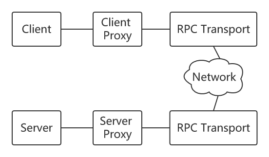

# 一个简易的RPC框架

## 基本架构

                  

## 模块分包

1. proxy：代理模块。分为consumer端代理和provider端代理，consumer端代理使用动态代理技术拦截本地调用发起远程调用，provider端使用反射技术根据consumer端的请求进行本地调用。
2. rpc：RPC协议模块。包含对RPC请求和RPC响应的封装和序列化。
3. remoting：远程通讯模块。负责consumer端请求的发送和provider端结果的返回。
4. registry：服务注册与发现模块。分别给consumer端和provider端提供服务发现和服务注册的功能。
5. services：服务模块。provider端提供的服务接口。

## 技术栈

1. 使用Netty进行远程NIO通信
2. 使用Kyro进行序列化与反序列化
3. 使用zookeeper作为注册中心，使用curator作为客户端进行服务注册与发现

## 特色功能

1. 支持RPC异步调用
2. 支持服务熔断与恢复，服务降级